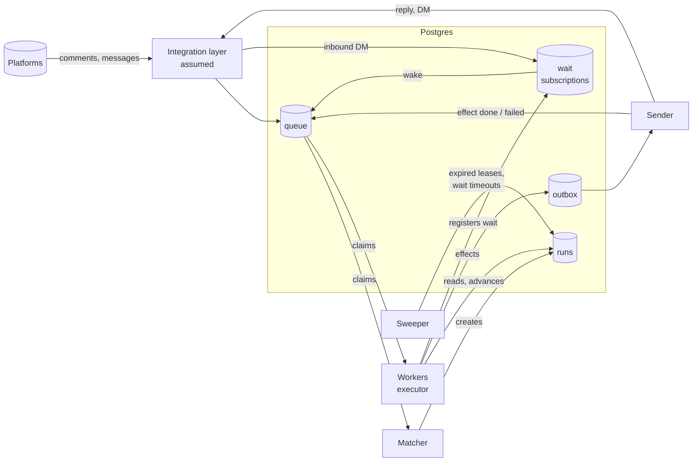
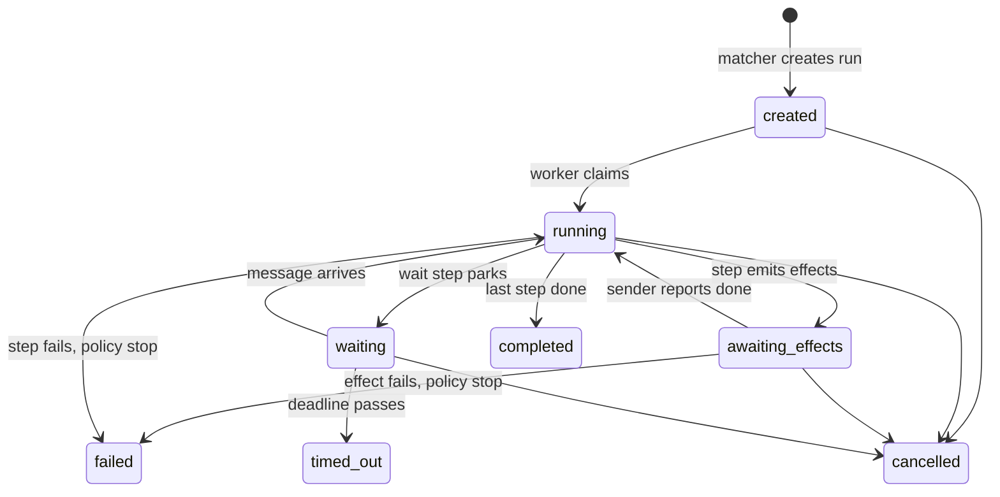

# Comment-triggered automations: backend design

A customer writes an instruction: "when someone comments *pricing* on any of my
Instagram posts, reply to the comment, DM them asking for their email, wait for
the answer, then DM them a link." This document describes a backend that runs
such instructions: the data model, the architecture, how a run executes, and what
keeps it correct.

It is only a design and doesn't include implementation. Integrations with the platforms, auth
and the customer UI are assumed to exist. The schema is in
[`schema.sql`](schema.sql).

## 1. The solution

An **automation** is a program consisting of a trigger and an ordered list
of steps. A **run** is one execution of that program for one trigger. An
**executor** runs it: each step is a pure function from (run state, incoming
event) to (new state, effects to perform, next step).

The effects are written to an **outbox** and performed by a separate
**sender**, the only component that talks to the platforms. Every effect is
awaited: after a step emits effects the run parks in the state
`awaiting_effects`, the sender reports each effect's outcome back as an
event, and only then does the executor move to the next step, or apply the
step's failure policy. So the public "Sent you a DM!" reply is never decided
until the DM has actually gone out.

A **wait subscription** connects an incoming message to the run waiting for
it. A message that arrives before the run reaches its wait step is kept on
the run and consumed when it gets there.

Postgres holds all of it, including the work queue and the outbox, so that
"advance the run and record what to send" is one transaction.

## 2. Assumptions

1. The integration layer delivers each comment and message to this system
   **exactly once**.
2. The platform imposes **no restrictions on messaging** a user who has
   commented.
3. The platform imposes **no rate limits** on outbound replies and messages.
4. **Load is moderate.** Outbound volume is bounded by platform limits and moderate usage, well
   below what a Postgres-backed queue handles.
5. Receiving comments and messages, replying to comments, and sending
   messages exist behind an adapter interface. The adapters identify the
   connected account, the commenter and the comment by stable, opaque
   handles; this system stores and passes them back without interpreting
   them, and the adapter resolves which account to send from.
6. **The email is asked for in order to collect it.** This design assumes the customer is building a
   contact list, which is why a captured email is stored as a contact.

## 3. Concepts and data model

**Automation.** The instruction. A trigger (connected account, which
posts it applies to, a keyword rule) and an ordered list of steps. Each step
has a type and settings. Automations are **versioned**: editing one creates a
new version. Edit does not change the meaning of a run in progress.

The example:

```json
{
  "trigger": { "account_id": "acc_1", "post_scope": "any",
               "keyword": "pricing", "match": "exact_word" },
  "steps": [
    { "type": "send_dm",       "text": "Hi! What's your email address?",
      "on_failure": "stop" },
    { "type": "reply_comment", "text": "Sent you a DM!",
      "on_failure": "stop" },
    { "type": "wait_message",  "extract": "email", "save_to": "contacts",
      "timeout": "48h",
      "on_match":    { "next": 4 },
      "on_no_match": { "next": 3, "max": 2 },
      "on_failure": "stop" },
    { "type": "send_dm",       "text": "Could you send your email address?",
      "next": 2, "on_failure": "stop" },
    { "type": "send_dm",       "text": "Here is the link: {{link}}",
      "on_failure": "stop" }
  ]
}
```

This is the **stored form** of the program. Implementation is separate. At runtime each step type is a function (section 5),
and `next` is how a step's chosen continuation is written down so that it
can be stored. Two things follow:

- **List order is storage order, not execution order.** The executor never
  walks the list; it only follows `next`. A step without `next` continues to
  the following index, which is the common case. Step 3 (the re-prompt) is
  reached only from the wait step's no-match outcome and returns to step 2;
  step 4 (the link) is reached only on a match.
- **The wait step is the only step that branches**, on its own outcome: the
  regex matched or it did not. 

Note the order: the DM is sent before the public reply. "Sent you a DM!" is a
public claim about something that has not happened yet. A DM can fail for
ordinary reasons (the user does not accept messages, a transient platform
error), and a public reply already posted has no undo. 

**Run.** One execution of an automation for one person. It holds the pinned
automation version, the triggering comment and user, the current step index,
a JSON **variables bag** for what steps have captured (the email), the step
results so far, its state (section 5), and the lease fields a worker uses to
claim it.

**Wait subscription.** A bookmark saying "run 42 is waiting for a message from
this user". Keyed on the person handle, an opaque value the integration
layer attaches to every inbound message; the account is reached through the
run's automation. It exists as its own row
because the inbound path must find the waiting run in one indexed lookup. It also
carries the deadline the timeout sweeper works from.

**Contact.** The reason the automation asks for the email: the customer
is collecting contacts. A contact is one person reached through the account's
automations: the person handle, the email (and later, other captured
fields), which run captured it and when. One row per person per account,
upserted when a step captures a value with `save_to: contacts`.

**Queue and outbox** (mechanics). The queue holds work waiting for a worker:
inbound events to match, runs to advance. The outbox holds outbound actions
that have been decided but not yet sent. Both are tables with row claims, see
section 4.

Variables are JSON rather than columns because what a step captures depends on
the step type and the set will grow.

## 4. Architecture



- **Matcher.** Takes an inbound comment, finds automations whose trigger
  matches (account, post scope, keyword), creates a run, and enqueues it. One transaction.
- **Workers.** Claim runs from the queue and execute them (section 5).
- **Sender.** Reads unsent outbox rows and calls the platform adapters. The
  only component that performs side effects against the platforms. When an
  effect has succeeded, or has failed for good, it enqueues an `effect_done`
  or `effect_failed` event for the run, in the same transaction that marks
  the outbox row.
- **Sweeper.** Re-queues runs whose worker lease expired, and times out wait
  subscriptions past their deadline.
- **Inbound DM path.** Looks up the active run for the person, joining
  through the automation to match the account.
  If the run is parked at a wait step, claims its subscription, attaches the
  message, and re-enqueues the run. If not, keeps the message on the run for
  the next wait step to consume.

### Why Postgres for the queue and the outbox

With one transactional store, "record the step result, advance the run, write
the outbound action" is a single commit. There is no window where the action
is sent but the state is lost, or the state is saved but the action forgotten.
Row claims use `SELECT ... FOR UPDATE SKIP LOCKED`: ten workers polling the
same table each get different rows with no coordination. A claim is a short
transaction that stamps the row with a worker id and a lease expiry and
commits; the work happens outside the transaction, so a crashed worker does
not hold a lock, and the sweeper re-queues its rows when the lease expires. An
index on the claimable predicate (status, run_after) keeps the claim query
cheap, and finished rows are archived on a schedule so the hot set stays small.

This assumes moderate load. A Postgres queue on a
modest instance handles hundreds of claims per second.

## 5. Execution model

**The step contract.** Each step type is a pure function:

```
step(state, event) -> (new state, [effects], successor)
```

`state` is the run's current state and variables, including the triggering
comment and user, which every step can read. `event` is what caused this step
to be invoked: the triggering comment (first step only), the completion of the
previous step or the sender's report on its effects, a message from the user,
or a timeout. `effects` are data describing what should happen: send this DM,
post this reply, register a wait for this user, save this contact. Effects
come in two kinds. **External** effects call a platform; they go to the
outbox and are awaited. **Local** effects write to this system's own tables
(saving a contact, registering a wait); the executor applies them in the same
transaction as the run update, so they cannot half-happen. `successor` is **the
next function to run**, chosen by this one: the wait step returns "send the
link" when the email parsed and "ask again" when it did not. In its pure form
this is a function returning a function. Because the run leaves memory
between steps and is resumed later by another process, the returned function is a value that names a step in the pinned automation
version (the `next` reference of section 3), which the executor resolves back
to a function on resume. "Park" and "done" are the two successors that are
not steps. The function performs nothing. It decides.

**The executor loop.** Claim a run. Apply the current step's function to the
state and the event. In one transaction: persist the new state and step result,
write the effects to the outbox (and the wait subscription, if any), move the
cursor to the successor. Then decide whether to keep going:

- If the step emitted external effects, release the run in state `awaiting_effects`.
  It does not advance until the sender reports those effects done. On
  `effect_done` the executor marks the step complete and continues with the
  successor; on `effect_failed` it applies the step's failure policy.
- If the successor is "park", release the run in state `waiting`.
- If the successor is "done", mark the run `completed`.
- Otherwise continue with the next step in the same claim.

**Why this framing.** The decision logic is testable with plain unit tests and
no mocks.

**The example, step by step.**

1. Anna comments "pricing". The matcher creates run 42 at step 0, state
   `created`, and enqueues it.
2. A worker claims run 42. Step 0 (`send_dm`) returns an effect "DM Anna: what
   is your email?" and successor 1. The worker writes the effect to the outbox
   and releases run 42 in state `awaiting_effects`.
3. The sender sends the DM and enqueues `effect_done(run 42, step 0)`. A
   worker claims the run, marks step 0 complete, and runs step 1
   (`reply_comment`): effect "reply to the comment", successor 2, and the run
   is `awaiting_effects` again. Had the sender given up on the DM instead, it
   would have enqueued `effect_failed`, the executor would have applied step
   0's policy, `stop`, and the run would be `failed` with the reply never
   decided.
4. The reply is posted, `effect_done` arrives, and step 2 (`wait_message`)
   runs. If Anna has already replied, her message is on the run and is consumed at once. Otherwise the step returns "register wait
   for Anna, deadline 48h" and successor "park"; the worker writes the
   subscription and releases the run in state `waiting`.
5. Anna replies. The inbound path claims her subscription, attaches the
   message, and re-enqueues run 42. A worker claims it; step 2's function now
   receives a `message` event, runs the email regex, stores the email in the
   variables bag, emits the local effect "save contact: Anna, email" (applied
   in the same transaction, upserting Anna into the account's contacts), and
   returns successor 4, the link step. If the regex finds nothing, the
   function emits nothing and returns successor 3, the re-prompt step: an
   ordinary `send_dm`, awaited like any other, whose own successor is 2. Back
   at step 2 the wait step registers a fresh subscription and parks again.
   The no-match count is kept in the run's variables, per step, so a crash
   does not reset it; when it passes `max`, the step's `on_failure` applies.
6. Step 4 (`send_dm`) renders the link, returns the effect, and, being last
   in the list with no `next`, successor "done". Run 42 is `completed`.

**Failure policy.** Every step carries `on_failure`. The default is `stop`: the
run goes to `failed`, and in the template that means a failed DM produces no
public reply. Some other fallback can be configured instead.

**Run states.**



`created` is distinct from `running` because the matcher and the worker act in
different transactions; "created but never claimed" is what the alarm
watches. `awaiting_effects` is the run parked on its own outbox: its effects
are written but not yet performed. It is kept separate from `waiting` because
the two mean different things to an operator (waiting on our sender versus
waiting on a person) and are treated differently. `timed_out` is distinct from `failed` because the product meaning
differs: the user went quiet, versus the system or platform did not do what it
was told. `cancelled` covers cancelling by hand.

## 6. Reliability and concurrency

1. **Every step is idempotent, and the outbox is why.** A worker can crash
   after deciding to send and before recording that it did. Each
   outbox row carries a key (run id, step index) and the table refuses a
   second row with the same key. 
2. **A reply can arrive before the wait step runs.** Because effects are
   awaited, the DM (step 0) is sent and confirmed before the wait step (step
   2) gets to register its subscription, and a fast reply can land in that
   gap. So the inbound path does not require a subscription to exist. It
   looks up the active run for the person, joining through the automation
   to match the account (an index on active runs by person keeps this
   cheap), and if no wait is open
   it stores the message on the run. The wait step consumes a stored message
   first and registers a subscription only if there is none. 
3. **The same person comments twice.** Per-automation policy: ignore, restart,
   or one active run per person. Default: one active run per person per
   automation, enforced by a unique partial index on active runs.
4. **Two replies arrive at once.** The subscription is claimed with an atomic
   first-wins update; the second reply finds nothing waiting and is ignored.
5. **Two workers on one run.** Prevented by the lease; as a backstop, a
   version number on the run row must match on write-back, or the write is
   rejected.
6. **Poison runs.** A failing step is retried with backoff up to a limit, then
   the run goes to `failed` and an alert fires, so one bad run cannot occupy
   a worker indefinitely.
7. **Editing an automation with runs in flight.** Runs pin the version they
   started on.
8. **Cleanup.** Finished runs, consumed subscriptions and sent outbox rows are
   archived or deleted on a schedule, so the tables workers poll stay small
   and vacuum keeps up.

## 7. Trade-offs, and what was not chosen

- **Linear step list, not a workflow graph.** Not here: a graph
  editor, branching on captured data (only on a step's own outcome), parallel
  branches, an expression language. Those are outside of a scope of 2 hour assignment.
- **Postgres queue and outbox, not a broker.** Chosen because Postgres is
  already in the product's stack and
  one transactional store removes the dual-write conflicts. The message broker is an extension point, and the outbox table stays even
  then, with a relay publishing from it.
- **Every side effect is awaited.** A run parks after any step that emits
  effects and resumes on the sender's report. Fire-and-forget effects were
  not chosen because the DM must be confirmed before the
  reply is decided, and because i complicates failure policies.
- **Regex for the email, with a bounded re-prompt loop**, rather than an LLM
  in the loop. Deterministic and free; the LLM is an extension point below.

## 8. Extension points

- **Inbound deduplication** (assumption 1): an inbound event table keyed on
  the platform's event id; the matcher and the inbound DM path insert first
  and ignore conflicts.
- **Messaging-window deadline** (assumption 2): if the platform only allows
  messaging a commenter for a limited time, the first DM step gets a
  deadline, after which the policy decides.
- **Per-account throttling** (assumption 3): the sender rate-limits per
  connected account and treats a rate-limit response as "try later".
- **Dedicated broker** (assumption 4): adopted for database isolation, fan-out (analytics and audit
  subscribe to the same events), and built-in dead-letter queues, backlog and
  consumer-lag metrics. 
- **LLM on regex failure** (email extraction): when the regex finds nothing,
  an LLM reads the user's message, trying to find email in it and if it doesn't find one it asks for the email in a natural way,
  replacing the fixed text of the re-prompt step.
- **Branching on captured data** (for example, one path for a company email
  and another for a personal one), via the same successor mechanism the
  re-prompt loop already uses.
- **Contact export and CRM sync**: contacts are exportable; pushing a
  new contact to the customer's CRM is one more step type, `sync_contact`,
  whose external effect goes through the outbox.
- **Observability**: a per-run timeline the customer can see, a per-step
  funnel, and an alarm for runs stuck in one state too long.

## 9. What is mine and where I used AI

I used Claude Code the way I use it at work: as a drafting partner and a
second opinion. I gave the direction, it produced drafts and explanations, and
I questioned, criticised and refined them; the design changed substantially
along the way, in several places because I challenged what the drafts had
glossed over.

The decisions that shape this design are mine: the order of the DM and the
public reply, the per-step failure policy, the functional execution model,
awaiting side effects, the stated assumptions, and others.
